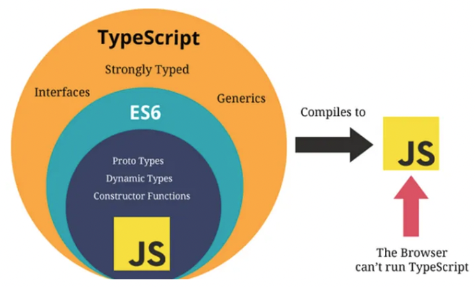
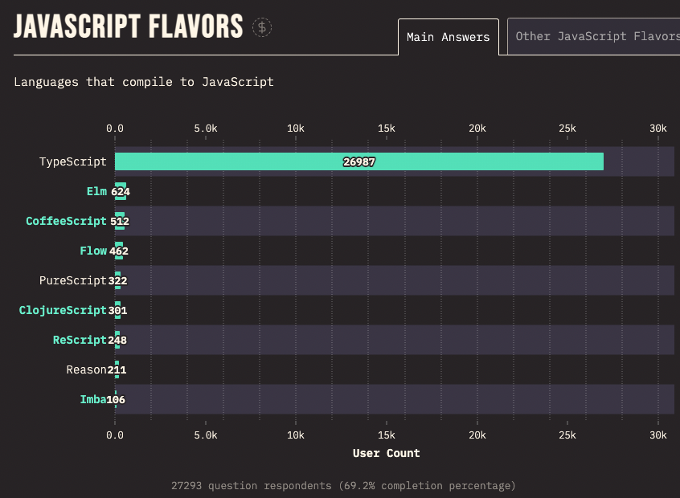
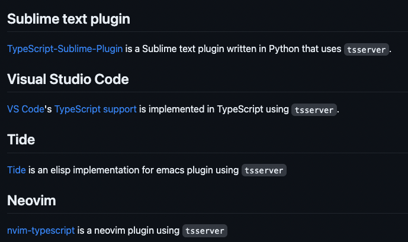
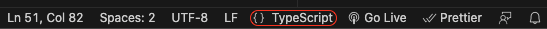
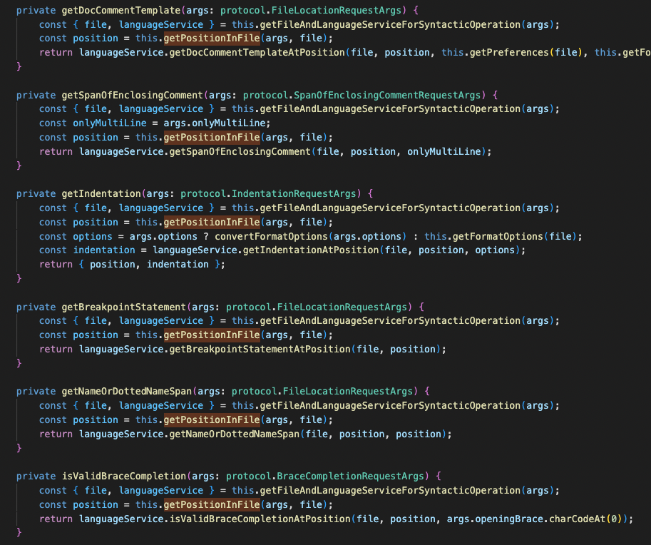

# [Typescript 소개](https://github.com/microsoft/TypeScript)

> Typescript는 MS에서 개발한 자바스크립트의 `상위 집합 언어`입니다. 타입스크립트는 정적 타입을 지원하며, 개발자에게 타입 검사, 코드 어시스트, 코드 완성 등의 기능을 제공하여 개발 프로세스를 개선합니다.
> 
1. <code style="color : red">**정적 타입 시스템**</code>: 타입스크립트는 정적 타입을 지원하여 개발자가 코드를 작성할 때 타입 에러를 사전에 감지할 수 있습니다. 이는 디버깅 시간을 단축시키고 코드의 안정성을 높이는 데 도움이 됩니다.
2. <code style="color : red">**객체지향 프로그래밍 지원**</code>: 타입스크립트는 클래스, 인터페이스, 상속, 제네릭 등 객체지향 프로그래밍 개념을 제공합니다. 이를 통해 코드의 구조화와 재사용성을 증가시킬 수 있습니다.
3. <code style="color : red">**최신 ECMAScript 기능 지원**</code>: 타입스크립트는 ECMAScript 표준에 따라 개발되며, 최신 자바스크립트 문법과 기능을 지원합니다. 이를 통해 타입스크립트는 자바스크립트 생태계의 발전에 기여하면서도 추가적인 타입 체크와 에러 방지 기능을 제공합니다.
4. <code style="color : red">**도구 지원**</code>: 타입스크립트는 tsserver를 통해 코드 어시스트, 자동 완성, 타입 검사 등 다양한 개발 도구와의 통합을 지원합니다. IDE나 편집기와 함께 사용하면 개발자의 생산성을 향상시킬 수 있습니다.

<p align="center">
  
</p>
<p align="center">javascript와 typescript의 관계</p>
<br/>

## Typescript 추세
<p align="center">
  
</p>
<p align="center">2022년까지 javascript 생태계중 가장 많이 사용된 자바스크립트 컴파일 언어</p>


# [tsserver란?](https://github.com/microsoft/TypeScript/wiki/Standalone-Server-(tsserver))

> 타입스크립트의 언어 서버(Language Server).  
개발시 <code style="color : red">IDE</code>나 <code style="color : red">텍스트 편집기</code>와 같은 도구에서 타입스크립트를 지원하기 위에 사용.
타입스크립트 독립형 서버이며, typescript 컴파일러와 언어 서비스를 캡슐화하고 <code style="color : red">JSON 프로토콜을 통해 노출하는 노드(Node.js) 실행 파일</code>

1. 타입 검사, 식별자 확인, 리팩토링 지원, 오류 표시 등
2. 다른 도구와의 통합을 용이하게 하기 위해 Language Server Protocol(`LSP`)를 따름
3. LSP는 서로 다른 개발 도구 사이에 표준화된 통신 프로토콜로, tsserver를 포함한 다양한 언어 서버와 개발 도구 사이의 상호 기능을 가능하게함.
<p align="center">
    
</p>
<p align="center">서브라임텍스트, VSCode, Tid, Neovim</p>
    
<br/>
<br/>

# 구조

## 동작순서

1. 에디터에서 ts 파일을 열면 편집기가 해당 파일에 대한 프로젝트를 초기화하도록 tsserver에 요청(ts 버전 및 구성 옵션 포함)
    <p align="center">
        
    </p>
    
2. **[tsconfig.json](https://www.typescriptlang.org/ko/docs/handbook/tsconfig-json.html)** 파일에서 프로젝트 구성을 읽고 해당 프로젝트에 typescript 를 설정
3. 편집기 입력시 vsc는 코드 완성, 코드 탐색 및 심볼 검색과 같은 기능을 위해 **tsserver에 실시간 요청**
4. 요청된 정보가 포함된 응답을 편집기로 전송
5. 파일 저장시 tsserver가 코드를 다시 확인하고 오류나 경고를 편집기에 보고

### 의도적인 하드코딩으로 통신 프로토콜을 이해하기 위한 시작점 제공

- quickinfo
    
    ```tsx
    // "quickinfo"
    // 마우스 올렸을시 짧은 정보를 보여주는 기능
    {
      "seq": 0,
      "type": "response",
      "command": "quickinfo",
      "request_seq": 1,
      "success": true,
      "body": {
        "kind": "var",
        "kindModifiers": "declare",
        "start": {
          "line": 2,
          "offset": 5
        },
        "end": {
          "line": 2,
          "offset": 12
        },
        "displayString": "var console: Console",
        "documentation": "",
        "tags": []
      }
    }
    ```
    
- getApplicableRefactors
    
    ```tsx
    // "getApplicableRefactors"
    // vscode의 라인 줄에 대한 명령(수정 표시 전구 모양)
    {
      "seq": 0,
      "type": "response",
      "command": "getApplicableRefactors",
      "request_seq": 2,
      "success": true,
      "body": [
        {
          "name": "Extract Symbol",
          "description": "Extract function",
          "actions": [
            {
              "description": "Extract to inner function in function 'x'",
              "name": "function_scope_0"
            },
            {
              "description": "Extract to function in global scope",
              "name": "function_scope_1"
            }
          ]
        }
      ]
    }
    ```
    
(참고: [tsserver 사용 example](https://github.com/mmorearty/tsserver-example))

## 서버 실행 순서

1. `initializeNodeSystem` 를 통해 `server.ts`에서 tsserver 실행([링크](https://github1s.com/microsoft/TypeScript/blob/release-5.1/src/tsserver/nodeServer.ts#L168-L169))
    ```tsx
    /** @internal */
    export function initializeNodeSystem(): StartInput { // ✅
        const sys = Debug.checkDefined(ts.sys) as ServerHost;
        const childProcess: {
            execFileSync(file: string, args: string[], options: { stdio: "ignore", env: MapLike<string> }): string | Buffer;
        } = require("child_process");
    ...

        class IOSession extends Session {
        ...

        listen() { 
            rl.on("line", (input: string) => {
                const message = input.trim();
                this.onMessage(message); // ✅
            });
        
            rl.on("close", () => {
                this.exit();
            });
        }
        ...
    }
    ```

2. onMessage ([링크](https://github1s.com/microsoft/TypeScript/blob/release-5.1/src/server/session.ts#L3553-L3554))
    ```tsx
    public onMessage(message: TMessage) {
    ...
        try {
        request = this.parseMessage(message); // ✅
        relevantFile = request.arguments && (request as protocol.FileRequest).arguments.file ? (request as protocol.FileRequest).arguments : undefined;

        tracing?.instant(tracing.Phase.Session, "request", { seq: request.seq, command: request.command });
        perfLogger?.logStartCommand("" + request.command, this.toStringMessage(message).substring(0, 100));

        tracing?.push(tracing.Phase.Session, "executeCommand", { seq: request.seq, command: request.command }, /*separateBeginAndEnd*/ true);
        const { response, responseRequired } = this.executeCommand(request); // ✅
        tracing?.pop();
    ...
    }

    protected parseMessage(message: TMessage): protocol.Request {
        return JSON.parse(message as any as string) as protocol.Request;
    }
    ```

3. executeCommand([링크](https://github1s.com/microsoft/TypeScript/blob/release-5.1/src/server/session.ts#L3539-L3540))
    ```tsx
    public executeCommand(request: protocol.Request): HandlerResponse {
        const handler = this.handlers.get(request.command); // ✅
        if (handler) {
            const response = this.executeWithRequestId(request.seq, () => handler(request));
            this.projectService.enableRequestedPlugins();
            return response;
        }
        else {
            this.logger.msg(`Unrecognized JSON command:${stringifyIndented(request)}`, Msg.Err);
            this.doOutput(/*info*/ undefined, protocol.CommandTypes.Unknown, request.seq, /*success*/ false, `Unrecognized JSON command: ${request.command}`);
            return { responseRequired: false };
        }
    }

    public executeWithRequestId<T>(requestId: number, f: () => T) {
        try {
            this.setCurrentRequest(requestId);
            return f();
        }
        finally {
            this.resetCurrentRequest(requestId);
        }
    }

    private setCurrentRequest(requestId: number): void {
        Debug.assert(this.currentRequestId === undefined);
        this.currentRequestId = requestId;
        this.cancellationToken.setRequest(requestId);
    }

    private resetCurrentRequest(requestId: number): void {
        Debug.assert(this.currentRequestId === requestId);
        this.currentRequestId = undefined!; // TODO: GH#18217
        this.cancellationToken.resetRequest(requestId);
    }
    ```

4. handler([링크](https://github1s.com/microsoft/TypeScript/blob/release-5.1/src/server/session.ts#L3110-L3111))
    ```tsx
    private handlers = new Map(Object.entries<(request: any) => HandlerResponse>({ // TODO(jakebailey): correctly type the handlers
        ...

        [protocol.CommandTypes.Quickinfo]: (request: protocol.QuickInfoRequest) => {
            return this.requiredResponse(this.getQuickInfoWorker(request.arguments, /*simplifiedResult*/ true));
        },
            [protocol.CommandTypes.GetApplicableRefactors]: (request: protocol.GetApplicableRefactorsRequest) => {
            return this.requiredResponse(this.getApplicableRefactors(request.arguments));
        },
            [protocol.CommandTypes.TodoComments]: (request: protocol.TodoCommentRequest) => {
            return this.requiredResponse(this.getTodoComments(request.arguments));
        },
            
            ...

            [protocol.CommandTypes.Open]: (request: protocol.OpenRequest) => { // ✅
            this.openClientFile(
                toNormalizedPath(request.arguments.file),
                request.arguments.fileContent,
                convertScriptKindName(request.arguments.scriptKindName!), // TODO: GH#18217
                request.arguments.projectRootPath ? toNormalizedPath(request.arguments.projectRootPath) : undefined);
            return this.notRequired();
        },
    }
    ```

5. getPosition, getPositionInFile, extractPositionOrRange ([링크](https://github1s.com/microsoft/TypeScript/blob/release-5.1/src/server/session.ts#L2038-L2039))
    ```tsx
    private getPositionInFile(args: protocol.Location & { position?: number }, file: NormalizedPath): number {
        const scriptInfo = this.projectService.getScriptInfoForNormalizedPath(file)!;
        return this.getPosition(args, scriptInfo);
    }

    private getPosition(args: protocol.Location & { position?: number }, scriptInfo: ScriptInfo): number { // ✅
        return args.position !== undefined ? args.position : scriptInfo.lineOffsetToPosition(args.line, args.offset);
    }

    private getQuickInfoWorker(args: protocol.FileLocationRequestArgs, simplifiedResult: boolean): protocol.QuickInfoResponseBody | QuickInfo | undefined {
            ...
        const quickInfo = project.getLanguageService().getQuickInfoAtPosition(file, this.getPosition(args, scriptInfo)); // ✅
            ...
    }

    private getApplicableRefactors(args: protocol.GetApplicableRefactorsRequestArgs): protocol.ApplicableRefactorInfo[] {
            ...
        return project.getLanguageService().getApplicableRefactors(file, this.extractPositionOrRange(args, scriptInfo), this.getPreferences(file), args.triggerReason, args.kind, args.includeInteractiveActions);
    }

    private extractPositionOrRange(args: protocol.FileLocationOrRangeRequestArgs, scriptInfo: ScriptInfo): number | TextRange {
        let position: number | undefined;
        let textRange: TextRange | undefined;
        if (this.isLocation(args)) {
            position = getPosition(args); // ✅
        }
        else {
            textRange = this.getRange(args, scriptInfo);
        }
        return Debug.checkDefined(position === undefined ? textRange : position);

        function getPosition(loc: protocol.FileLocationRequestArgs) {
            return loc.position !== undefined ? loc.position : scriptInfo.lineOffsetToPosition(loc.line, loc.offset);
        }
    }
    ```

<p align="center">
    
</p>
<p align="center">Position을 커맨드마다 지정하는 모습</p>

6. [PerfLogger](https://github1s.com/microsoft/TypeScript/blob/release-5.1/src/compiler/perfLogger.ts) 인터페이스
    ```tsx
    // 일반적인 콘솔 로그를 찍지 않고 perfLogger를 사용한 이유?
    // 빠른 속도로 이벤트 추적이 가능해던 이유!
    /** @internal */
    export interface PerfLogger {
        logEvent(msg: string): void;
        logErrEvent(msg: string): void;
        logPerfEvent(msg: string): void;
        logInfoEvent(msg: string): void;
        logStartCommand(command: string, msg: string): void;
        logStopCommand(command: string, msg: string): void;
        logStartUpdateProgram(msg: string): void;
        logStopUpdateProgram(msg: string): void;
        logStartUpdateGraph(): void;
        logStopUpdateGraph(): void;
        logStartResolveModule(name: string): void;
        logStopResolveModule(success: string): void;
        logStartParseSourceFile(filename: string): void;
        logStopParseSourceFile(): void;
        logStartReadFile(filename: string): void;
        logStopReadFile(): void;
        logStartBindFile(filename: string): void;
        logStopBindFile(): void;
        logStartScheduledOperation(operationId: string): void;
        logStopScheduledOperation(): void;
    }

    // Load optional module to enable Event Tracing for Windows
    // See https://github.com/microsoft/typescript-etw for more information
    let etwModule: typeof import("@microsoft/typescript-etw") | undefined;
    try {
        const etwModulePath = process.env.TS_ETW_MODULE_PATH ?? "./node_modules/@microsoft/typescript-etw";

        // require() will throw an exception if the module is not found
        // It may also return undefined if not installed properly
        etwModule = require(etwModulePath);
    }
    catch (e) {
        etwModule = undefined;
    }

    /**
     * Performance logger that will generate ETW events if possible - check for `logEvent` member, as `etwModule` will be `{}` when browserified
     *
     * @internal
     */
    export const perfLogger: PerfLogger | undefined = etwModule?.logEvent ? etwModule : undefined;
    ```

참고 - 1 ) [ETW](https://learn.microsoft.com/ko-kr/windows-hardware/drivers/devtest/event-tracing-for-windows--etw-)

참고 - 2 ) [@microsoft/typescript-etw](https://github.com/microsoft/typescript-etw)

# 마치면서
<p align="center">
    
</p>